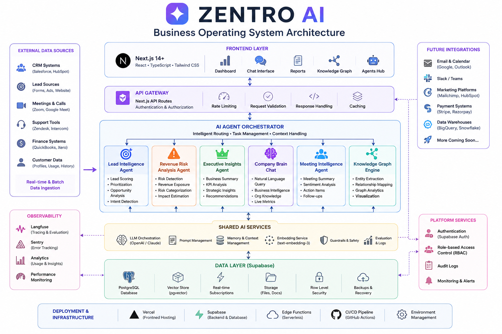

# Zentro AI

🏆 Built for the Microsoft Agents League Hackathon 2026 – Reasoning Agents Track

**One Brain For Your Entire Business.**

Zentro AI is a multi-agent Business Operating System that transforms fragmented business data into intelligent decisions. Built for the Microsoft Agents League Reasoning Agents Challenge, it combines Executive Insights, Lead Intelligence, Revenue Risk Analysis, Meeting Intelligence, Knowledge Graphs, and Microsoft IQ-inspired reasoning into a unified intelligence platform.



---

## Why Zentro AI

Modern businesses generate enormous amounts of information across CRM systems, meetings, customer interactions, support channels, and revenue operations. However, this data remains fragmented across multiple tools, making it difficult for leaders to understand business health, identify risks, and take action quickly.

Zentro AI transforms disconnected information into prioritized, evidence-backed decisions through a collaborative network of specialized AI agents.

---

## Core Agents

### Microsoft IQ Reasoning Agent

Plans compound business questions, retrieves business context and governed policies, and produces explainable recommendations with citations and confidence scores.

### Executive Insights Agent

Provides leadership with real-time visibility into opportunities, business risks, performance metrics, and recommended actions.

### Lead Intelligence Agent

Evaluates opportunities, scores leads, explains the reasoning behind each score, and recommends the next best action.

### Revenue Risk Agent

Identifies churn signals, declining engagement patterns, and revenue exposure before they become critical business problems.

### Meeting Intelligence Agent

Converts conversations into actionable business intelligence by extracting summaries, decisions, action items, sentiment, and risks.

### Company Brain & Knowledge Graph

Connects customers, leads, meetings, opportunities, actions, and risks into a shared organizational memory that supports cross-functional reasoning.

---

## Technology Stack

* Next.js
* React
* TypeScript
* Tailwind CSS
* Supabase
* Knowledge Graph Architecture
* Multi-Agent System Design
* Microsoft IQ-Inspired Reasoning Layer
* Foundry IQ-Inspired Knowledge Retrieval
* Fabric IQ-Inspired Business Ontology

---

## Microsoft IQ Architecture

Zentro AI includes an integration-ready Microsoft IQ reasoning layer designed around concepts inspired by Foundry IQ and Fabric IQ.

### Foundry IQ Layer

Provides organizational knowledge, business policies, governance rules, playbooks, and institutional memory.

### Fabric IQ Layer

Provides business ontology definitions including entities, relationships, metrics, business rules, and operational context.

### Reasoning Engine

Combines information from both layers to generate grounded recommendations with:

* Multi-step reasoning
* Evidence-backed responses
* Citations
* Confidence scoring
* Explainable decision paths

The repository currently operates in a clearly labeled local demo mode without cloud credentials. Live Foundry IQ and Fabric IQ integrations require provisioning and validation through Microsoft cloud resources.

For deployment details, see:

* docs/MICROSOFT_IQ_SETUP.md

---

## Reasoning Workflow

1. User submits a business question.
2. Microsoft IQ Agent decomposes the request into reasoning tasks.
3. Fabric IQ-inspired ontology provides business entities, relationships, and operational context.
4. Foundry IQ-inspired knowledge retrieval provides policies, governance rules, and organizational guidance.
5. The reasoning engine synthesizes evidence across multiple sources.
6. The system generates recommendations with citations, confidence scores, and explainable reasoning steps.

---

## Run Locally

Requirements:

* Node.js 20+
* npm

```bash
git clone https://github.com/gurleen55555/zentro-ai-agents-league.git
cd zentro-ai-agents-league
npm install
copy .env.example .env.local
npm run dev
```

Open:

http://localhost:3000

The default configuration uses the local Microsoft IQ demo adapter. Optional Supabase and live Foundry IQ variables are documented in `.env.example`.

---

## Demo Prompt

Suggested query:

> Which revenue risks need executive attention and what policy should we follow?

---

## Submission Materials

* docs/SUBMISSION_CHECKLIST.md
* docs/MICROSOFT_IQ_SETUP.md
* docs/VIDEO_PRODUCTION_PLAN.md
* microsoft-iq/fabric-iq/ontology-definition.json
* microsoft-iq/foundry-iq/knowledge-base.sample.json

---

## Verification

```bash
npm run lint
npm run build
```

Both commands pass successfully on the submission version.

---

## Vision

Our vision is simple:

Every business deserves one brain for its entire operation.

Not another dashboard.

Not another chatbot.

A system that understands, reasons, learns, and helps organizations make better decisions.

---

## License

MIT
