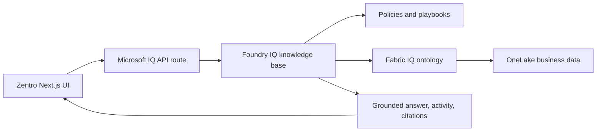

# Microsoft IQ Setup for Zentro

Zentro runs in `demo` mode without cloud resources. Real Foundry IQ and Fabric IQ require an Azure subscription, a Microsoft Foundry project, Azure AI Search, and a Microsoft Fabric workspace.

## Architecture



Foundry IQ supplies governed institutional knowledge. Fabric IQ supplies the semantic business state through entities, relationships, rules, metrics, and data agents. The Zentro agent combines both to recommend actions.

## No-Azure Demo

1. Install dependencies with `npm install`.
2. Copy `.env.example` to `.env.local`.
3. Keep `MICROSOFT_IQ_MODE=demo`.
4. Run `npm run dev`.
5. Open the Microsoft IQ Reasoning Agent panel and run any suggested prompt.

Demo mode performs the same visible stages as the intended cloud flow: plan, query Fabric IQ, query Foundry IQ, synthesize, and cite. It is intentionally labeled `Demo adapter`.

## Real Foundry IQ and Fabric IQ

These steps require Microsoft cloud access:

1. Create a Microsoft Fabric workspace with OneLake data for customers, leads, meetings, revenue risks, and actions.
2. Create a Fabric IQ ontology using `microsoft-iq/fabric-iq/ontology-definition.json` as the domain blueprint, then bind its entities and relationships to the OneLake tables.
3. Create an Azure AI Search service that supports agentic retrieval.
4. In Microsoft Foundry, create a Foundry IQ knowledge base.
5. Add the Fabric IQ ontology as a knowledge source.
6. Add a policy/playbook knowledge source for the governed action rules.
7. Configure the knowledge base using `microsoft-iq/foundry-iq/knowledge-base.sample.json` as a reference.
8. Create a query key for Azure AI Search and set:

```env
MICROSOFT_IQ_MODE=foundry
FOUNDRY_IQ_SEARCH_ENDPOINT=https://your-search-service.search.windows.net
FOUNDRY_IQ_KNOWLEDGE_BASE=zentro-business-kb
FOUNDRY_IQ_API_KEY=your-query-key
FOUNDRY_IQ_API_VERSION=2025-11-01-preview
```

The key remains server-side. The browser calls `/api/microsoft-iq`; only that route calls the Foundry IQ knowledge base.

## What To Show Judges

1. Ask a compound question about revenue risk.
2. Show the four reasoning stages.
3. Point out that Fabric IQ provides the customer/risk relationship and revenue exposure.
4. Point out that Foundry IQ provides the governed escalation policy.
5. Show the grounded recommendation and citations.
6. Explain that switching from demo to live requires only the server-side environment configuration after the Microsoft resources are provisioned.

## Honest Submission Language

Use `Microsoft IQ integration-ready with a working local demo adapter` until the app is connected to a real Foundry IQ knowledge base and Fabric IQ ontology. After live resources are connected and tested, use `Integrated with Foundry IQ and Fabric IQ`.
